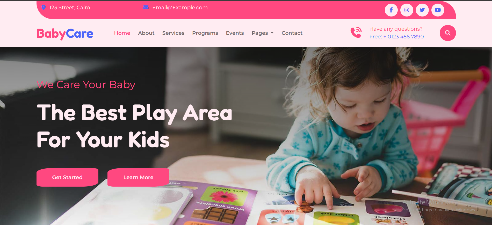

# BabyCare Website 👶

**BabyCare** is a modern, responsive landing page designed for a kids' play area and learning center. The website showcases the center's services, programs, events, team members, and testimonials with a vibrant and child-friendly design.

## 🔗 Live Demo
https://baby-care-landing-page-nine.vercel.app/

##  Preview

## 🚀 Features

- **Fully Responsive Design** - Optimized for all devices (mobile, tablet, desktop)
- **Modern UI/UX** - Clean and attractive interface with smooth hover effects
- **Custom CSS Variables** - Easy theme customization with CSS variables
- **Bootstrap 5 Framework** - Responsive grid system and components
- **Font Awesome Icons** - Rich iconography throughout the site
- **Smooth Animations** - Hover effects and transitions for better user experience
- **Semantic HTML Structure** - Well-organized code for SEO and accessibility

## 🛠 Technologies Used

- **HTML5** - Semantic markup
- **CSS3** - Custom styling with CSS variables
- **Bootstrap 5.3** - Responsive framework
- **Font Awesome 6** - Icons and visual elements
- **Google Fonts** - Montserrat and Fredoka fonts

## 📸 Sections

- **Header** - Navigation bar with contact info and social media links
- **Hero Section** - Main banner with call-to-action buttons
- **About Us** - Information about the center
- **Services** - Key services offered (Study & Game, A:Z Programs, Expert Teacher, Mental Health)
- **Programs** - Featured programs with pricing and details
- **Events** - Upcoming events calendar
- **Our Team** - Expert teachers showcase
- **Testimonials** - Client reviews and feedback
- **Footer** - Contact info, location, gallery, and newsletter signup

## 🌐 Deployment

The project is deployed using **Vercel**.

## 👩‍💻 Author

**Rawda Ashraf Gabal**

- LinkedIn:  
https://www.linkedin.com/in/rawda-ashraf-gabal

---